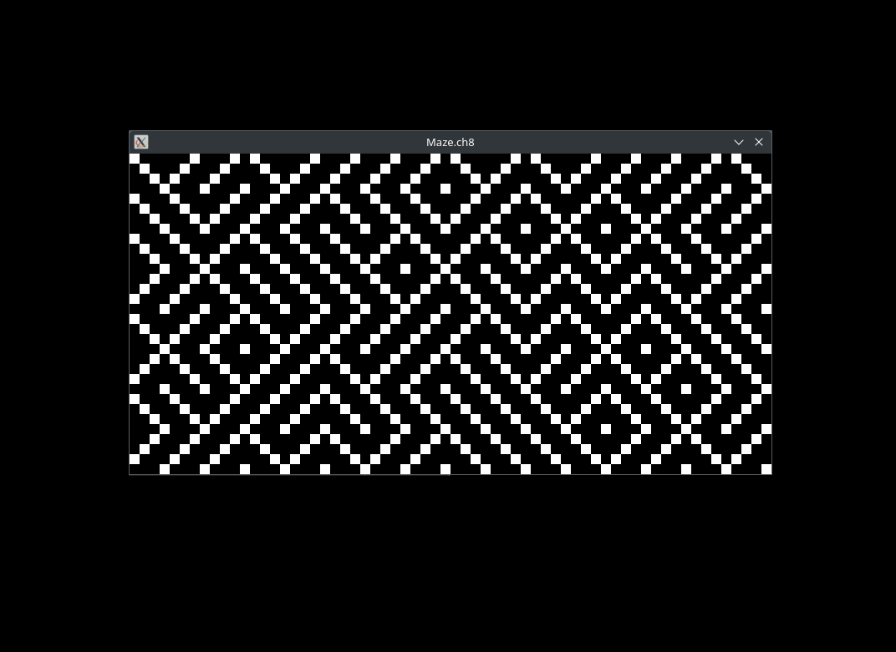
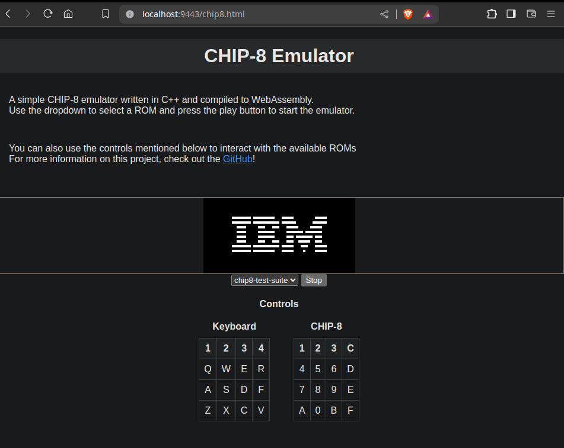

# CHIP-8

a basic chip8 emulator written in C++. uses SDL for input/graphics
<br>
**note:** all of the roms in this repository are public domain
<br><br>


## **prerequisite libraries:**

### SDL2 installation:
```console
Debian/Ubuntu:  sudo apt-get install libsdl2-dev -y
  
or check out the SDL2 wiki's **Installation** section:
  https://wiki.libsdl.org/SDL2/Installation        
```
<br>

### CMake installation:
```console
Debian/Ubuntu:  sudo apt-get install cmake
  
or download it directly from the cmake website:
  https://cmake.org/download/
```
<br>

### Emscripten SDK (optional, for WebAssembly):
download + installation guide:
https://emscripten.org/docs/getting_started/downloads.html
<br><br>


## **setup:**
### to install this repository:
```console
git clone "https://github.com/sameersaeed/chip8-emulator"
```
<br>


### building and running the binary
starting from project root, run:

```console
mkdir build && cd build

cmake ..
make

./chip8 <scale> ../roms/<ROM-name>.ch8
```
if you run the binary correctly, you should see a window pop up on your screen with the ROM running, for example:


<br>


### (optional) compiling to WebAssembly

starting from project root, run:

```console
cd client/

emcc ../src/emscriptenMain.cpp ../src/chip8.cpp ../src/gui.cpp  -I ../include -s ALLOW_MEMORY_GROWTH=1 -s ASSERTIONS=2 -s USE_SDL=2 -s WASM=1 -s SAFE_HEAP=1 -s DISABLE_EXCEPTION_CATCHING=0 -s EXPORTED_FUNCTIONS=_main,_load,_stop -s EXPORTED_RUNTIME_METHODS=ccall,cwrap --no-heap-copy --preload-file ../roms --shell-file shell.html -o chip8.html
```
<br>


### to launch the client locally, you can then run:

```console
emrun --port <port> .
```
(or)
```console
python3 -m http.server <port>
```
...and then go on [http://localhost:&lt;port&gt;/chip8.html](https://github.com/sameersaeed/chip8-emulator)

from there, you should be able to select a ROM file and load it into your browser:


<br>

if you want to use your own .ch8 ROM file(s), you can add them to the roms/ folder of this repository and then update shell.html to add the path(s), i.e.:
```console
  ...
  <option value='{"filename": "chip8-test-suite.ch8"}'>chip8-test-suite</option>
  <option value='{"filename": "ParticleDemo.ch8"}'>ParticleDemo</option>
  <option value='{"filename": "ZeroDemo.ch8"}'>ZeroDemo</option>
  <option value='{"filename": "<your-rom-file>.ch8"}'>Your ROM's Name</option>
  ...
```
after doing this, you will also need to make sure to recompile the program using the above Emscripten compilation script (emcc)
<br><br>


## **sample installation + run (binary):**
```console
git clone "https://github.com/sameersaeed/chip8-emulator" 

cd chip8-emulator

mkdir build && cd build

cmake .. 
make

./chip8 3 ../roms/Maze.ch8
```
a scale factor of 3 creates a 192 x 96px display (3 * (64 x 32px) = 192 x 96px)
<br><br>


## **references:**
 - http://devernay.free.fr/hacks/chip8/C8TECH10.HTM                                (opcodes)
 - https://multigesture.net/articles/how-to-write-an-emulator-chip-8-emulator/  (0xDxyn implementation)
 - https://en.wikipedia.org/wiki/CHIP-8                                            (general info)